# Travel Recharge Database
## TransMilenio Bogota - SITP Simulation

## Project Description

### Context

This project provides a comprehensive simulation database for Bogotá's Integrated Public Transportation System (SITP), including TransMilenio. It aims to model various facets of the system to support the development, testing, and demonstration of related applications, such as a card recharge and travel tracking API, real-time information systems, and operational analytics.

The database schema and generated data are designed to reflect the complexities of a large-scale public transit system, encompassing:
- User and transit card management.
- Detailed operational infrastructure: stations (portals, troncal, cable, zonal paraderos), routes, depots, and operating concessionaires.
- Extensive vehicle fleet information with types and technologies.
- Fare structures and card recharge mechanisms.
- Logging of individual passenger trips, including multi-leg journeys with transfers.
- Simulation of real-time data feeds like vehicle locations and station arrival predictions.
- System alerts and aggregated ridership statistics (e.g., top destinations).

The system ensures traceability of recharges and user trips, maintaining a precise history to allow for complex queries, performance testing, and audits. This project is based on publicly available information and statistics from TransMilenio S.A. to achieve a high degree of realism.

### Core Features

- **User Management:** Registration, profile data.
- **Card Management:** Issuance, status tracking, balance updates, association with users.
- **Fare System:** Definition of various fare types (standard, transfer) and their validity periods.
- **Recharge System:** Logging of card recharges at various physical and online points.
- **Infrastructure Modeling:**
    - **Locations:** Operational zones within the city.
    - **Stations:** Detailed information for all station types (Portals, Troncal, Cable, Zonal Paraderos), including geographic data and amenities like cycle parking.
    - **Depots:** Vehicle storage and maintenance yards.
    - **Concessionaires:** Registration of operating companies and their service capabilities (Troncal, Zonal, Cable).
- **Operational Data:**
    - **Vehicles:** Comprehensive fleet data including type, capacity, technology, model year, and assignment to concessionaires/depots.
    - **Drivers:** Operator data including assignment to concessionaires.
    - **Routes:** Definition of all route types (Troncal, Zonal UCE, Alimentadora, Cable) with origin, destination, operating concessionaire, and detailed intermediate station sequences.
- **Trip Logging:** Recording of individual passenger journeys, including boarding/disembarking stations and times, vehicle, driver, route taken, fare applied, and handling of transfers with linked trip legs.
- **Real-time Data Simulation:**
    - **Arrival Predictions:** Snapshot data for `realtime_arrivals` at stations.
    - **Vehicle Locations:** Snapshot data for `route_current_location`.
    - *Note: For realistic load testing, these tables should ideally be updated dynamically by the application/simulation backend.*
- **System Alerts:** Logging of service alerts (informational, warnings, critical) which can be system-wide or specific to routes/stations.
- **Aggregated Statistics:** The `station_destinations` table is designed to hold pre-calculated top destinations from origin stations, derived from trip data.

## Database Schema

The database is designed to model the entities and relationships within the SITP.

```mermaid
erDiagram
    USERS {
        BIGINT user_id PK
        TEXT first_name
        TEXT last_name
        TEXT contact_number
        TEXT email UK
        TEXT gender
        DATE date_of_birth
        TEXT residential_address
        TEXT id_number UK
        TEXT city_of_birth
        DATE registration_date
    }

    LOCATIONS {
        BIGINT location_id PK
        TEXT name UK
        TEXT description
    }

    CONCESSIONAIRES {
        BIGINT concessionaire_id PK
        TEXT name UK
        BOOLEAN operates_troncal
        BOOLEAN operates_zonal_uce
        BOOLEAN operates_zonal_alimentacion
        BOOLEAN operates_cable
    }

    VEHICLES {
        BIGINT vehicle_id PK
        TEXT license_plate UK
        TEXT vehicle_type
        INTEGER capacity
        TEXT technology
        INTEGER model_year
        BIGINT concessionaire_id FK
        TEXT status
        BIGINT current_depot_id FK
    }

    STATIONS {
        BIGINT station_id PK
        TEXT name
        TEXT station_code UK
        TEXT station_type
        TEXT address
        BIGINT location_id FK
        DOUBLE_PRECISION latitude
        DOUBLE_PRECISION longitude
        BOOLEAN has_cycle_parking
        INTEGER cycle_parking_spots
        BOOLEAN is_active
    }

    ROUTES {
        BIGINT route_id PK
        TEXT route_code UK
        TEXT route_name
        TEXT route_type
        BIGINT origin_station_id FK
        BIGINT destination_station_id FK
        BIGINT concessionaire_id FK
        BOOLEAN is_active
    }

    INTERMEDIATE_STATIONS {
        BIGINT intermediate_station_id PK
        BIGINT route_id FK
        BIGINT station_id FK
        INTEGER sequence_order
    }

    CARDS {
        BIGINT card_id PK
        TEXT card_number UK
        BIGINT user_id FK
        DATE acquisition_date
        TEXT status
        DOUBLE_PRECISION balance
        TIMESTAMP last_used_date
        DATE update_date
    }

    RECHARGE_POINTS {
        BIGINT recharge_point_id PK
        TEXT name
        TEXT address
        DOUBLE_PRECISION latitude
        DOUBLE_PRECISION longitude
        BIGINT location_id FK
        TEXT operator
    }

    FARES {
        BIGINT fare_id PK
        TEXT fare_type
        DOUBLE_PRECISION value
        DATE start_date
        DATE end_date
        TEXT description
    }

    RECHARGES {
        BIGINT recharge_id PK
        BIGINT card_id FK
        BIGINT recharge_point_id FK
        DOUBLE_PRECISION amount
        TIMESTAMP recharge_timestamp
        TEXT transaction_id UK
    }

    TRIPS {
        BIGINT trip_id PK
        BIGINT card_id FK
        BIGINT vehicle_id FK
        BIGINT route_id FK
        BIGINT driver_id FK
        BIGINT boarding_station_id FK
        BIGINT disembarking_station_id FK
        TIMESTAMP boarding_time
        TIMESTAMP disembarking_time
        BIGINT fare_id FK
        BOOLEAN is_transfer
        TEXT transfer_group_id
    }

    REALTIME_ARRIVALS {
        BIGINT arrival_id PK
        BIGINT station_id FK
        BIGINT route_id FK
        BIGINT vehicle_id FK
        TIMESTAMP estimated_arrival_time
        TIMESTAMP actual_arrival_time
        TEXT status
        TIMESTAMP created_at
    }

    ROUTE_CURRENT_LOCATION {
        BIGINT location_update_id PK
        BIGINT route_id FK
        BIGINT vehicle_id FK
        DOUBLE_PRECISION latitude
        DOUBLE_PRECISION longitude
        DOUBLE_PRECISION speed
        TIMESTAMP timestamp
    }

    ALERTS {
        BIGINT alert_id PK
        TEXT message
        TEXT severity
        TEXT alert_type
        TIMESTAMP start_timestamp
        TIMESTAMP end_timestamp
        BIGINT station_id FK
        BIGINT route_id FK
    }

    STATION_DESTINATIONS {
        BIGINT destination_id PK
        BIGINT origin_station_id FK
        BIGINT final_destination_station_id FK
        INTEGER trip_count
        TEXT aggregation_period
    }

    DRIVERS {
        BIGINT driver_id PK
        TEXT employee_id UK
        TEXT first_name
        TEXT last_name
        BIGINT concessionaire_id FK
        DATE hire_date
        TEXT license_number UK
        TEXT license_expiry_date
        TEXT status
    }

    DEPOTS {
        BIGINT depot_id PK
        TEXT name UK
        TEXT address
        TEXT depot_type
        INTEGER capacity_vehicles
        BIGINT location_id FK
        BIGINT concessionaire_id FK
    }

    USERS ||--o{ CARDS : "has"
    CARDS ||--o{ RECHARGES : "receives"
    RECHARGE_POINTS ||--o{ RECHARGES : "done_at"
    LOCATIONS ||--o{ RECHARGE_POINTS : "located_in"
    LOCATIONS ||--o{ STATIONS : "located_in"
    LOCATIONS ||--o{ DEPOTS : "located_in"

    CONCESSIONAIRES ||--o{ VEHICLES : "owns"
    CONCESSIONAIRES ||--o{ ROUTES : "operates"
    CONCESSIONAIRES ||--o{ DRIVERS : "employs"
    CONCESSIONAIRES ||--o{ DEPOTS : "uses"

    STATIONS ||--o{ ROUTES : "origin_for"
    STATIONS ||--o{ ROUTES : "destination_for"
    STATIONS ||--o{ INTERMEDIATE_STATIONS : "is_part_of_route"
    STATIONS ||--o{ TRIPS : "boarding_at"
    STATIONS ||--o{ TRIPS : "disembarking_at"
    STATIONS ||--o{ REALTIME_ARRIVALS : "arrivals_for"
    STATIONS ||--o{ ALERTS : "alert_for_station"
    STATIONS ||--o{ STATION_DESTINATIONS : "origin_stats"
    STATIONS ||--o{ STATION_DESTINATIONS : "final_stats"

    ROUTES ||--o{ INTERMEDIATE_STATIONS : "has_sequence"
    ROUTES ||--o{ TRIPS : "taken_on"
    ROUTES ||--o{ REALTIME_ARRIVALS : "arrivals_on"
    ROUTES ||--o{ ROUTE_CURRENT_LOCATION : "location_for"
    ROUTES ||--o{ ALERTS : "alert_for_route"

    VEHICLES ||--o{ TRIPS : "used_for"
    VEHICLES ||--o{ REALTIME_ARRIVALS : "vehicle_arriving"
    VEHICLES ||--o{ ROUTE_CURRENT_LOCATION : "current_vehicle"
    DEPOTS ||--o{ VEHICLES : "houses"

    DRIVERS ||--o{ TRIPS : "drives_for"

    CARDS ||--o{ TRIPS : "used_by"
    FARES ||--o{ TRIPS : "applies_to"

```

(Please note: Mermaid diagrams for very large schemas can sometimes be challenging to render perfectly or might require adjustments for optimal display in all Markdown viewers. The relationships are illustrative.)

# Data Generation

This project includes a sophisticated Python-based data generator designed to populate the database with a large volume of realistic, interconnected data, drawing insights from official TransMilenio statistics (specifically, "Estadísticas de oferta y demanda del Sistema Integrado de Transporte Público - SITP - Junio 2024").

### Process:

1. The data generator consists of a series of Python scripts (e.g., `1_insert_users.py`, `2_insert_cards.py`, etc., orchestrated by a main script or run individually). **These scripts are intended to be run locally by the developer/tester, not automatically by Docker during container startup.**
2. These scripts generate individual `.sql` files containing `INSERT` statements for each table. These files are saved in the `db/data/generated_sql_scripts/ directory.` 
3. The `station_destinations` table is populated differently: an SQL script named (for example) `16_populate_station_destinations.sql` is provided. This script, when executed by PostgreSQL, performs a direct aggregation on the `trips` table to calculate and insert the top destination data. This ensures data accuracy for this summary table.

### Data Quantities and Realism:
The generated data aims for a high degree of realism based on the referenced TransMilenio PDF. However, for practical local testing and development, the volume for certain high-transaction entities has been scaled down. The infrastructure and operational entities generally reflect real-world numbers.

Approximate record counts (can be adjusted in generator scripts):

- **Users:** ~25,000 (Scaled down by a factor of 100 from a real-world estimate of ~2.5 million)
- **Cards:** ~24,000, with ~20,000 active (Scaled down by 100)
- **Trips (for one simulated week - June 3-9, 2024):** ~75,000 - 90,000 (Scaled down by 100)
- **Stations:** ~7,765 (9 Portals, 4 Cable, 129 other Troncal, 7623 Zonal Paraderos - reflects real numbers)
- **Routes:** ~558 (99 Troncal, 5 Dual, 347 Zonal UCE, 106 Alimentadora, 1 Cable - reflects real numbers)
- **Vehicles:** 10,563 (reflects real numbers)
- **Drivers:** ~24,446 (reflects real numbers)
- **Recharge Points:** ~4,800 (reflects real numbers)
- **Concessionaires:** 27 (reflects real numbers)
- **Depots:** 58 (reflects real numbers)
- **Recharges:** ~7-8 million (scaled down by a factor that makes sense relative to cards, or you can set a specific scaled number e.g. ~70,000-80,000)
- **Other tables** (`locations`, `fares`, `realtime_arrivals`, `route_current_location`,` alerts`) are populated with a representative number of records suitable for testing.

The data simulates usage patterns such as daily transaction volumes, peak hour concentrations for trips, and transfer behaviors between different system components.

## Deployment Guide

For instructions on how to deploy this project, please refer to the [Deployment Guide](DEPLOYMENT.md).

## API Repository

The API for this database is available at the following repository:
[Travel Recharge API](https://github.com/FreddyB200/travel-recharge-api)

## Credits

This repository is a fork of the original project created by my database professor, [Cristian Fernando](https://github.com/cfernandom). The original repository served as the foundation for this project, and I have made improvements and modifications to adapt it to my needs and to incorporate a more detailed simulation based on TransMilenio's public data.

---
*This project is an academic simulation and is not affiliated with, endorsed or approved by TransMilenio S.A. The data used is public and the project is for educational and testing purposes only.*

