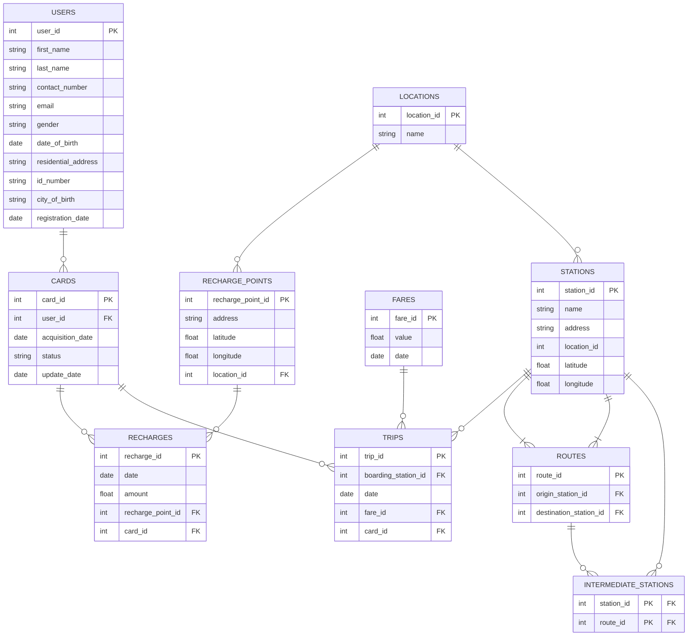

## Project Description

### Context

A public transportation company in Bogotá is looking to modernize its card recharge and travel tracking system. This module enables:

- User registration and card management.
- Management of authorized recharge points.
- Logging of card balance top-ups.
- Monitoring of stations, routes, and trips.
---
The system ensures traceability of recharges and user trips, maintaining a precise history of each transaction to allow queries and audits.
---
### Core Features
---
**Users:**

- User and card registration.
- Management of card balances.

--- 

**Authorized Recharge Points:**

- Registration of recharge points with geographic data (latitude, longitude) and locality.
---
**Recharges:**

- Each recharge is logged with date, amount, and location.
- Historical tariffs allow accurate queries based on date.
---
**Stations and Routes:**

- Station registration with geographic data.
- Route definition with origin, destination, and intermediate stations.
---
**Trips:**

- Logs each trip, including boarding station and automatic balance deduction.
---
## Deployment Guide

For instructions on how to deploy this project, please refer to the [Deployment Guide](DEPLOYMENT.md).

## Credits

This repository is a fork of the original project created by my database professor, [Cristian Fernando](https://github.com/cfernandom). The original repository served as the foundation for this project, and I have made improvements and modifications to adapt it to my needs.

## Fake Data Generator

The following notebook generates synthetic data for the schema. Data may include inconsistencies. Feel free to modify and adapt the notebook for your own datasets:

[Google Colab Notebook](https://colab.research.google.com/drive/1P0vnmkWPp9hxLaNTr7Ads2Osryb3bWIV?usp=sharing)
